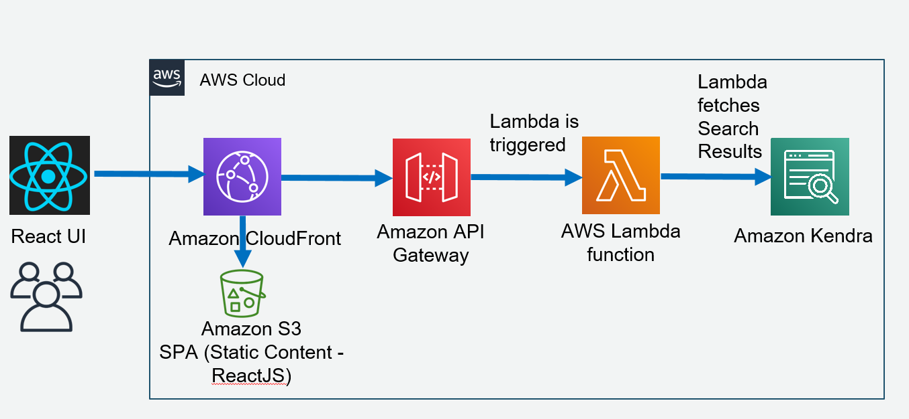

## Building Amazon Kendra search UI using Amaozn S3 and Amazon CloudFront
This project aims to help you provision a ready-to-use website for kendra search UI using s3 and cloudfront by simply running few CDK commands.




## Prerequisites
- [x] Create Kendra serverless webstack as per [steps](https://github.com/aws-samples/amazon-kendra-serverless-webstack)

## Set up

```bash
npm install
```

## Available Scripts

### Deploy
 ```bash
cdk bootstrap
cdk deploy
```

## Security

See [CONTRIBUTING](CONTRIBUTING.md#security-issue-notifications) for more information.

## License

This library is licensed under the MIT-0 License. See the LICENSE file.

